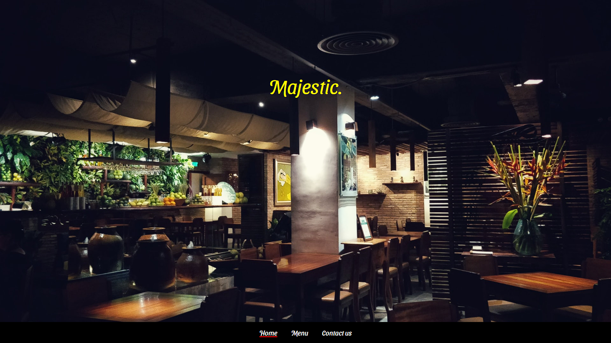

  
# Majestic Restaurant page.  

Simple restaurant page built using JavaScript DOM manipulation, Webpack loaders, Webpack plugins, and code modularization using JavaScript modules.

All the assets were added manipulating the page DOM using JavaScript, also Webpack was used to bundle all the .js, png, and CSS files.

  

## Built With

- HTML
- CSS
- JavaScript
- Webpack

## Live Demo

[Live Demo Link](https://shaqri.github.io/Book_library/?status=read)

## Getting Started

To get a local copy  and to set it up and running follow these simple example steps.

### Prerequisites

- Browser
- Internet

- Download the code from repository (https://github.com/Shaqri/restaurantPage-JS.git) and double click the index.html file

## Author

👤 **Victor Gonzalez Buitrago**

- Github: [Shaqri](https://github.com/Shaqri)
- Twitter: [@victorgonbu1](https://twitter.com/victorgonbu1)
- Linkedin: [Victor Gonzalez](https://www.linkedin.com/in/victor-manuel-gonzalez-buitrago/)

## Show your support

Give a ⭐️ if you like this project!

## Acknowledgments
-This project gave us a better understanding of the visual properties that must be used on a website.

## 📝 License

This project is [MIT](LICENSE) licensed.
